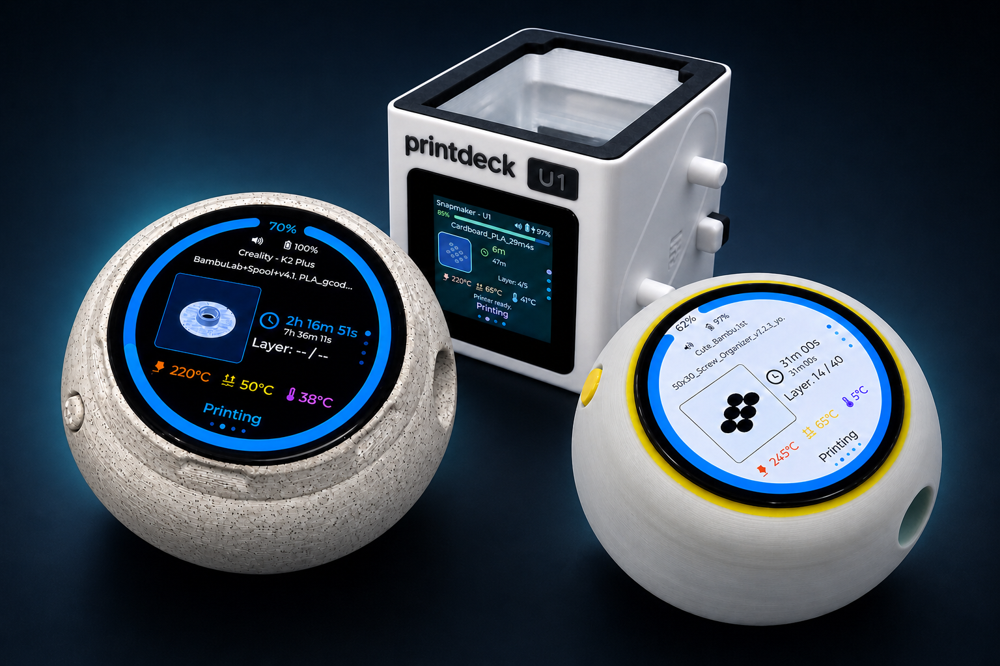

# PrintDeck

**Your print status, always in view.**

PrintDeck is independent firmware built by 3D-printing enthusiasts for the
community. It turns a compatible third-party touch display into a dedicated
local companion for your 3D printer. It connects directly to Klipper and
supported Bambu Lab printers, keeping progress, tools, temperatures and camera
views one glance away—without requiring a cloud account.

[Project website](https://printdeck.xyz/) ·
[Install firmware](https://printdeck.xyz/firmware/) ·
[Case designs](https://printdeck.xyz/case-designs/) ·
[User manual](https://printdeck.xyz/printdeck-user-manual.pdf)

## Built for a glance

- **Live print status:** job phase, progress, temperatures, layers and timing on
  a screen that remains ready while the printer is active.
- **Multi-tool clarity:** automatic discovery of up to twelve Moonraker
  extruders, including live and target temperatures, filament material and
  colour.
- **Local camera views:** support for compatible Bambu Lab and Moonraker camera
  sources, plus dedicated no-printer-modification support for Snapmaker U1 and
  Creality K2 cameras.
- **Local by design:** PrintDeck connects directly to the printer and stores
  printer credentials on the device.
- **Power-aware:** configurable OLED power saving with touch, button and
  print-completion wake-up behavior.
- **Easy maintenance:** guided USB installation, factory reset and
  configuration-preserving USB or over-the-air updates.

## Device Unified API

PrintDeck can expose an optional, token-protected and read-only Unified Printer
API on the device's local IP address. It translates Klipper/Moonraker and
supported Bambu Lab telemetry into one stable JSON format, so dashboards,
Home Assistant, Node-RED and custom software can read printer status,
temperatures, nozzles and material data without implementing each vendor's
protocol; see the [Unified Printer API overview](https://printdeck.xyz/unified-printer-api/).

## Home Assistant integration

The native PrintDeck integration discovers compatible devices through mDNS,
asks for the Unified API token in the Home Assistant interface and creates a
device with printer phase, activity, progress, timing, layer, temperature and
connection entities. It polls one aggregate local endpoint every ten seconds;
printer credentials remain on PrintDeck.

Until PrintDeck is included in the default HACS catalog, add this repository as
a custom **Integration** repository in HACS, download **PrintDeck**, restart
Home Assistant and choose **Settings > Devices & services > Add integration >
PrintDeck**. Enable Unified Printer API in PrintDeck Web Config before setup.
The integration requires a PrintDeck firmware version that advertises native
Home Assistant support.

Ready-made automation blueprints are also available:

- [turn on a light when a print finishes](https://my.home-assistant.io/redirect/blueprint_import/?blueprint_url=https%3A%2F%2Fraw.githubusercontent.com%2FPrintDeck%2FPrintDeck%2Fmain%2Fblueprints%2Fautomation%2Fprintdeck%2Flight_when_print_finishes.yaml);
- [use different lights at 25%, 50% and 75%](https://my.home-assistant.io/redirect/blueprint_import/?blueprint_url=https%3A%2F%2Fraw.githubusercontent.com%2FPrintDeck%2FPrintDeck%2Fmain%2Fblueprints%2Fautomation%2Fprintdeck%2Fprogress_milestone_lights.yaml).

Polish, Spanish, French, German and Simplified Chinese blueprint variants live
next to the English files under `blueprints/automation/printdeck/`.

## U1 Mini case

For Snapmaker U1, PrintDeck recognizes the stock configuration over the local
network and presents live job, tool and temperature data on a focused companion
display. The square U1 Mini enclosure mirrors the printer's shape, while
dedicated camera support works without modifying the printer.

## Supported display boards

PrintDeck supports three hardware variants with the same navigation, printer
features and settings:

- **Round:** Waveshare ESP32-S3 Touch AMOLED 1.75, 466 × 466;
- **Square:** Waveshare ESP32-S3 Touch LCD 1.54, 240 × 240.
- **KNOMI2:** KNOMI2, 240 × 240.

Each display target has an independent version, immutable release and stable OTA
channel. The round AMOLED remains the default build target.

## Get started

1. Choose one of the supported display boards.
2. Connect it to your computer over USB-C.
3. Open the guided [PrintDeck Web Installer](https://printdeck.xyz/firmware/).
4. Add your printer through PrintDeck Web Config.

The installer can perform a complete first installation or factory reset. It
can also update a configured device over USB without erasing Wi-Fi, printer or
display settings. Updates are additionally available from Web Config.

## Cases and hardware

The Riverstone, The Scuttle and Snapmaker U1 Mini enclosure designs cover the two
supported display formats. Experienced builders can use the project
[bill of materials](docs/BOM.md); it documents compatibility requirements
without recommending individual sellers or unverified components.

The supported display boards are manufactured by third parties. If you need
help selecting compatible components, assembling a personal build or
installing the firmware, [contact PrintDeck Support](https://printdeck.xyz/support/)
about individual assembly assistance.

## Source and support

The shipping firmware source, required build inputs and reviewed generated
product assets are available in this repository. Installation and updates use
the published target-specific firmware and browser installer.

Security issues should be reported according to [SECURITY.md](SECURITY.md).
General support routes are listed in [SUPPORT.md](SUPPORT.md).

## License

PrintDeck's original software and accompanying documentation are licensed
under the [PolyForm Noncommercial License 1.0.0](LICENSE). The license permits
use, modification and distribution for noncommercial purposes, subject to its
terms and the attribution requirements in [NOTICE](NOTICE).

Commercial use, including selling PrintDeck firmware, modified versions, DIY
sets or devices containing the software, requires a separate written license
from the copyright holder. [Contact PrintDeck Support](https://printdeck.xyz/support/)
to discuss commercial licensing.

Third-party components and assets remain subject to their own licenses, listed
in [THIRD_PARTY.md](THIRD_PARTY.md) and alongside the relevant files. The
PrintDeck name, project branding and product photography may not be used to
imply sponsorship, endorsement or an official PrintDeck product.

## Authors

- [Gulios](https://github.com/gulios)
- [Kitek](https://github.com/kitekkitek)

## Links and resources

- [Project website and product overview](https://printdeck.xyz/)
- [Guided Web Installer](https://printdeck.xyz/firmware/)
- [Case designs](https://printdeck.xyz/case-designs/)
- [User manual](https://printdeck.xyz/printdeck-user-manual.pdf)
- [Support](https://printdeck.xyz/support/)
- [Bill of materials](docs/BOM.md)
